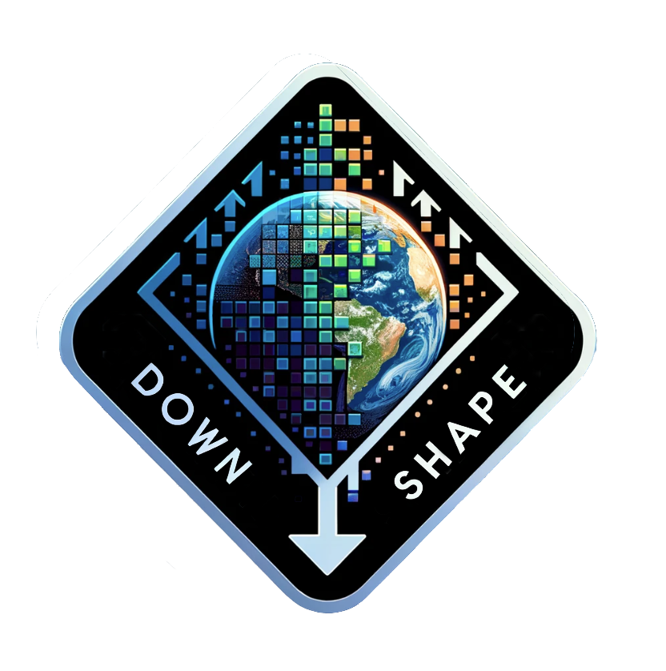

<h2> Hello!  </h2>
  <b class="term" >  I'm PhD student in marine ecology :ocean: at university of Reunion island (Indian ocean, France :fr:) 

 

  
  

 

- :clipboard: I'm working on spatial ecology of tropical seabirds :bird: with tracking data come from tag deployed on several species 
- :information_source: More information about my [:mortar_board: thesis](https://www.theses.fr/s321772) and my [:pushpin: lab](https://umr-entropie.ird.nc/index.php/team/fernandez-romain)
- :mailbox: How to reach me: romain.fernandez@univ-reunion.fr </b>

## :computer: My R packages in progress

 

<pre>
  
</pre>